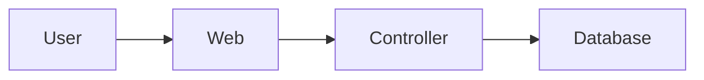

# Architecture Diagrams

Use this skill when the user asks for architecture diagrams, architectural documentation, codebase maps, dependency diagrams, C4/Structurizr models, live visual explanations, or project-specific architecture tooling.

## Operating Model

Prefer three layers:

1. **Live explanation diagrams**: use Mermaid directly in the assistant response. These are disposable and do not need files unless the user asks to keep them.
2. **Deterministic generated evidence**: use project-defined architecture commands and source-code scanners. These should produce facts or diagrams from code, schema, routes, modules, package metadata, traces, or other runtime artifacts.
3. **Authoritative durable docs**: update reviewed architecture docs/models such as Structurizr DSL, Markdown under `docs/architecture/`, and ADR links.

Do not present LLM-invented diagrams as authoritative. Cite source files, generated facts, or existing docs when making architectural claims.

## Tools

When available, use these pi tools:

- `diagram_inventory`: list diagram-as-code files in the repo.
- `diagram_render`: validate/render Mermaid, D2, Graphviz DOT, PlantUML, or Structurizr diagram files with local CLIs.
- `diagram_show`: open rendered SVG/PNG/JPEG/GIF/WebP/PDF artifacts in a detached local viewer.
- `architecture_commands`: list project-defined deterministic architecture commands from `.pi/architecture.json`.
- `architecture_command`: run a named deterministic architecture command from `.pi/architecture.json`.
- `architecture_queries`: list project-defined focused architecture queries from `.pi/architecture.json`.
- `architecture_query`: run a named focused architecture query with structured JSON args.

If a CLI is missing, follow the project's Nix/runtime guidance. Prefer project wrappers first (`nix develop -c`, `bash ./bin/in-env`, `package.json` scripts, `make`, `just`), then ephemeral Nix commands when appropriate. Do not ask the user to install tools globally.

## Live Response Diagrams

For quick answers, embed Mermaid in the response:

```markdown

```

Use live diagrams for:

- explaining request flow
- comparing alternatives
- sketching dependencies
- answering “how does this fit together?”

Keep them small and label uncertain edges as tentative.

## Showing Diagrams

Use `diagram_show` only when it is likely to help the user, for example:

- the user explicitly asks to see/open/show a diagram
- you just rendered a non-trivial diagram artifact and visual inspection is part of the task
- you need the user to review layout/readability before committing or proceeding

Do not open viewer windows for every small exploratory diagram. For quick inline Mermaid explanations, normally just include the diagram in the response. If you open a diagram, mention the path you opened.

## Durable Documentation Workflow

Before editing durable architecture docs:

1. Inspect existing docs with `diagram_inventory` and normal file reads.
2. Check for project deterministic commands with `architecture_commands`.
3. Run relevant generators before making claims.
4. For focused questions, inspect `architecture_queries` and run `architecture_query` instead of inventing ad hoc grep pipelines.
5. Edit diagram source files, not generated SVG/PNG files, unless the generated file is the only artifact requested.
6. Validate or render changed diagrams with `diagram_render` or the project command.
7. Record provenance in the doc: source files inspected, generator command, query result, or generated facts file.

## Project Architecture Commands And Queries

A project can define `.pi/architecture.json`. The harness stays generic: it discovers commands/queries, validates args, displays structured results, and checks artifact paths. Project repos own scanners, classifiers, and architecture semantics.

```json
{
  "metadata": {
    "description": "Project-owned architecture evidence generated from source.",
    "capabilities": ["facts", "diagrams", "focused-queries"],
    "factModel": "versioned entities/relationships with provenance"
  },
  "commands": {
    "facts": {
      "description": "Generate deterministic architecture facts.",
      "command": ["bash", "./scripts/architecture/generate-facts.sh"]
    },
    "render": {
      "description": "Render architecture diagrams.",
      "command": ["bash", "./scripts/architecture/render.sh"]
    }
  },
  "queries": {
    "component": {
      "description": "Generate a focused component diagram.",
      "intent": "Explain one component from observed project facts.",
      "capabilities": ["diagram", "provenance"],
      "command": ["bash", "./scripts/architecture/query.sh"],
      "parameters": {
        "kind": { "type": "string", "enum": ["service", "module", "table"] },
        "target": { "type": "string", "required": true },
        "depth": { "type": "number", "default": 1 },
        "direction": { "type": "string", "enum": ["upstream", "downstream", "both"], "default": "both" }
      }
    }
  }
}
```

Use `architecture_command` rather than manually reconstructing project-specific generation steps. Use `architecture_query` for focused/user-specific questions that need parameters.

## Structured Query Contract

`architecture_query` passes a JSON payload to the configured command on stdin and also sets environment variables:

- `PI_ARCHITECTURE_QUERY_NAME`
- `PI_ARCHITECTURE_QUERY_ARGS_JSON`
- `PI_ARCHITECTURE_QUERY_PAYLOAD_JSON`

Input payload:

```json
{
  "name": "component",
  "args": {
    "kind": "module",
    "target": "Billing",
    "depth": 2,
    "direction": "both"
  }
}
```

The project command should write a structured JSON object to stdout. Diagrams are optional; some architecture questions are better answered with metrics, tables, sections, warnings, and provenance:

```json
{
  "summary": "Generated focused diagram for Billing.",
  "warnings": ["No high-confidence runtime edges were found."],
  "metrics": { "nodes": 12, "edges": 18 },
  "tables": [
    { "title": "referenced files", "rows": [{ "path": "src/Billing.ts", "relationship": "source" }] }
  ],
  "sections": [
    { "title": "Notes", "content": "This is a view over generated facts, not a source of truth." }
  ],
  "artifacts": [
    { "path": ".pi/tmp/architecture-query/component-billing.svg", "kind": "diagram", "language": "svg" },
    { "path": ".pi/tmp/architecture-query/component-billing.dot", "kind": "source", "language": "dot" }
  ],
  "provenance": {
    "sources": ["src/Billing.ts"],
    "generatedFrom": "output/architecture/facts.json",
    "confidence": "high"
  }
}
```

Artifact paths must stay inside `docs/`, `diagrams/`, `output/`, `build/`, or `.pi/tmp/`.

## Adding Architecture Support To A Project

When asked to add architecture tooling to a new project:

1. Read the root and nearest `AGENTS.md`, `README.md`, architecture docs, ADRs, and relevant code layout.
2. Identify the project runtime wrapper and package manager. Examples: `bash ./bin/in-env`, `nix develop -c`, `npm run`, `make`, or `just`.
3. Choose deterministic source inputs: schema, routes, modules, imports, package manifests, IaC files, API specs, traces, or generated types.
4. Add `.pi/architecture.json` with stable `commands` for whole-project facts/diagrams and parameterized `queries` for focused questions.
5. Implement project scanners and semantic classifiers in the repo, not in pi-harness. Keep pi-harness generic.
6. Ensure commands run through the project environment wrapper so project-specific CLIs are present.
7. Prefer common diagram formats supported by the harness (`dot`/Graphviz and D2). Use Mermaid/PlantUML/Structurizr only when the project provides those CLIs.
8. Write global generated outputs to an agreed directory, commonly `output/architecture/` if ignored or `docs/architecture/generated/` if committed.
9. Write focused temporary query outputs under `.pi/tmp/architecture-query/` or a project-specific `.pi/tmp/architecture-*` subdirectory.
10. Document how to regenerate, how to run freshness checks, and whether generated outputs are committed.
11. Use versioned facts, provenance, and confidence where possible. Prefer intent-based query names (`request-flow`, `realtime-usage`, `generated-contracts`) over names tied to temporary implementation mechanisms.
12. Validate by running `architecture_commands`, `architecture_queries`, at least one `architecture_command`, and at least one `architecture_query`.

## CLI Availability Guidance

Pi-harness should provide common generic diagram/runtime tools such as Graphviz DOT, D2, and a viewer. Project-specific scanners and heavier tools should come from the project environment.

For Nix projects, configure `.pi/architecture.json` commands to enter the project environment, for example:

```json
{ "command": ["bash", "./bin/in-env", "architecture-facts"] }
```

For Node projects, prefer checked-in `package.json` scripts. For Make/Just projects, keep aliases thin and route to deterministic scripts.

## Promotion Policy

- If the user asks an exploratory question: respond with Mermaid inline if useful, or run a focused `architecture_query` when available.
- If the user asks to keep the diagram: create or update diagram source under the project docs.
- If the user asks for authoritative architecture: use project generators and/or architecture models, then update durable docs.
- If generated evidence contradicts existing prose: flag drift and prefer current code/generated facts.
