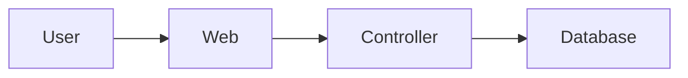

# Architecture Diagrams

Use this skill when the user asks for architecture diagrams, architectural documentation, codebase maps, dependency diagrams, C4/Structurizr models, or live visual explanations.

## Operating Model

Prefer three layers:

1. **Live explanation diagrams**: use Mermaid directly in the assistant response. These are disposable and do not need files unless the user asks to keep them.
2. **Deterministic generated evidence**: use project-defined architecture commands and source-code scanners. These should produce facts or diagrams from code, schema, routes, modules, or package metadata.
3. **Authoritative durable docs**: update reviewed architecture docs/models such as Structurizr DSL, Markdown under `docs/architecture/`, and ADR links.

Do not present LLM-invented diagrams as authoritative. Cite source files, generated facts, or existing docs when making architectural claims.

## Tools

When available, use these pi tools:

- `diagram_inventory`: list diagram-as-code files in the repo.
- `diagram_render`: validate/render Mermaid, D2, Graphviz DOT, PlantUML, or Structurizr diagram files with local CLIs.
- `architecture_commands`: list project-defined deterministic architecture commands from `.pi/architecture.json`.
- `architecture_command`: run a named deterministic architecture command from `.pi/architecture.json`.

If a CLI is missing, follow the project's Nix guidance. Prefer project wrappers first, then ephemeral `nix shell nixpkgs#<package> -c ...` when appropriate.

## Live Response Diagrams

For quick answers, embed Mermaid in the response:

```markdown

```

Use live diagrams for:

- explaining request flow
- comparing alternatives
- sketching dependencies
- answering “how does this fit together?”

Keep them small and label uncertain edges as tentative.

## Durable Documentation Workflow

Before editing durable architecture docs:

1. Inspect existing docs with `diagram_inventory` and normal file reads.
2. Check for project deterministic commands with `architecture_commands`.
3. Run relevant generators before making claims.
4. Edit diagram source files, not generated SVG/PNG files, unless the generated file is the only artifact requested.
5. Validate or render changed diagrams with `diagram_render` or the project command.
6. Record provenance in the doc: source files inspected, generator command, or generated facts file.

## Project Architecture Commands

A project can define `.pi/architecture.json`:

```json
{
  "commands": {
    "facts": {
      "description": "Generate deterministic architecture facts.",
      "command": ["bash", "./scripts/architecture/generate-facts.sh"]
    },
    "render": {
      "description": "Render architecture diagrams.",
      "command": ["bash", "./scripts/architecture/render.sh"]
    }
  }
}
```

Use `architecture_command` rather than manually reconstructing project-specific generation steps.

## Promotion Policy

- If the user asks an exploratory question: respond with Mermaid inline if useful.
- If the user asks to keep the diagram: create or update diagram source under the project docs.
- If the user asks for authoritative architecture: use project generators and/or architecture models, then update durable docs.
- If generated evidence contradicts existing prose: flag drift and prefer current code/generated facts.
